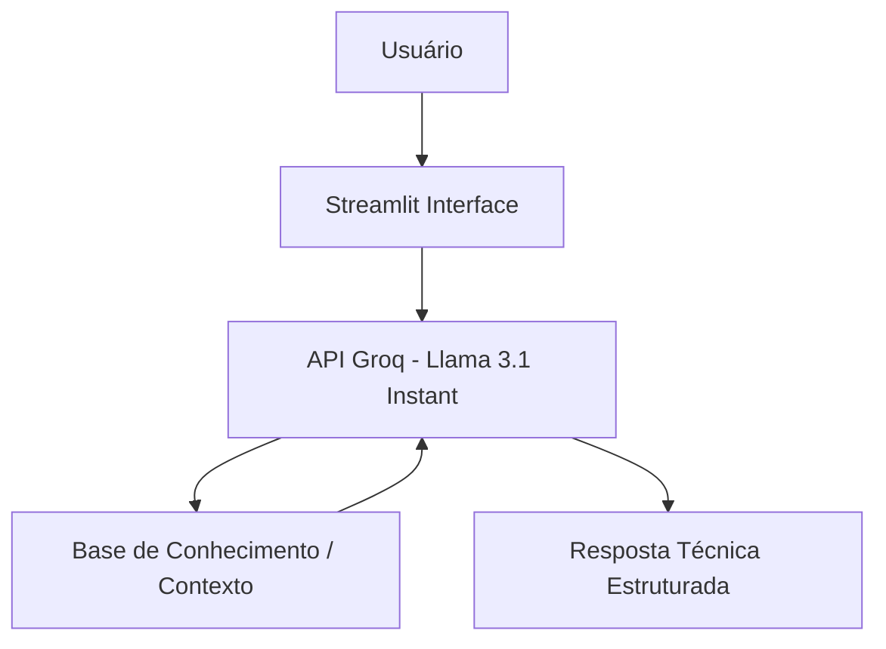

# 🎓 DBA Mentor: Seu Assistente de Banco de Dados com IA

Agente de Inteligência Artificial especializado em modelagem de dados, arquitetura de banco de dados e consultas SQL, desenvolvido para atuar como um mentor técnico, didático e paciente.

## 💡 O Que é o DBA Mentor?

O DBA Mentor é um assistente inteligente focado em apoiar estudantes e profissionais de dados. Ele explica conceitos complexos de normalização, modelagem (conceitual, lógica e física) e otimização de consultas utilizando uma base de conhecimento técnica e diretrizes de comportamento rigorosas.

### O que o DBA Mentor faz:
✅ Explica conceitos de banco de dados e SQL de forma simples e didática
✅ Utiliza uma base de conhecimento técnica estruturada (`conhecimento_sql.txt`)
✅ Formata comandos SQL em blocos bem identados e limpos
✅ Mantém histórico de conversação para continuidade no aprendizado

### O que o DBA Mentor NÃO faz:
❌ Não responde sobre assuntos fora de tecnologia e banco de dados
❌ Não executa comandos destrutivos de produção sem alertas de segurança
❌ Não inventa respostas técnicas (possui guardrails anti-alucinação)

---

## 🏗️ Arquitetura do Sistema



---

## 🛠️ Stack Tecnológica
Linguagem: Python

Interface Web: Streamlit

Motor de IA (Nuvem): Groq (Modelo llama-3.1-8b-instant)

Comunicação: Biblioteca requests


## 📁 Estrutura do Repositório

📂 data/ — Base de conhecimento técnica

📄 conhecimento_sql.txt — Contexto injetado na IA

📂 docs/ — Documentação e materiais

📂 src/ — Código-fonte principal

📄 app.py — Aplicação Streamlit e regras do agente

📄 .gitignore — Proteção de arquivos locais e sensíveis

📄 pitch.md — Apresentação do projeto

📄 README.md — Documentação principal


## 🎯 Exemplos de Uso

> **Exemplo 1: Pergunta técnica dentro do escopo**
> * **Usuário:** "O que é a Terceira Forma Normal (3FN)?"
> * **DBA Mentor:** *"A Terceira Forma Normal estabelece que uma tabela está na 2FN e não possui dependências transitivas, ou seja, nenhum atributo não-chave deve depender de outro atributo não-chave. Todos os dados devem depender exclusivamente da chave primária..."*

---

> **Exemplo 2: Pergunta fora do escopo (Proteção de domínio)**
> * **Usuário:** "Me fale como posso comprar um celular"
> * **DBA Mentor:** *"Desculpe, mas meu foco é ajudar você apenas com assuntos de Banco de Dados e Tecnologia."*


## 🎥 Pitch de Apresentação

Para entender a dor que o assistente resolve e ver o racional por trás deste agente, gravei um vídeo de apresentação (Pitch) 

👉 (https://www.youtube.com/watch?v=vNAcgPA7oIQ)


## 🚀 Como Executar o Projeto

Siga os passos abaixo para rodar a aplicação localmente:

```bash
# 1. Clone o repositório
git clone [https://github.com/Willian-Santos-DBA/Assistente-Virtual-Inteligencia-Artificial-DBA-Assistant.git](https://github.com/Willian-Santos-DBA/Assistente-Virtual-Inteligencia-Artificial-DBA-Assistant.git)
cd Assistente-Virtual-Inteligencia-Artificial-DBA-Assistant

# 2. Instale as dependências
pip install streamlit requests

# 3. Configure sua chave de API (Groq)
# Acesse o Groq Console e crie sua chave de API gratuita.
# Abra o arquivo src/app.py e insira sua chave da API do Groq na variável GROQ_API_KEY.

# 4. Inicie a aplicação
python -m streamlit run src/app.py
